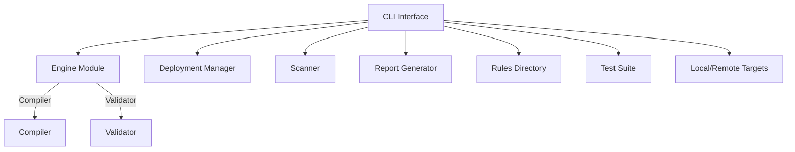

```mermaid
    graph TD
        A[CLI Interface] --> B[Engine Module]
        B --> |"Compiler"| C[Compiler]
        B --> |"Validator"| D[Validator]
        A --> E[Deployment Manager]
        A --> F[Scanner]
        A --> G[Report Generator]
        A --> H[Rules Directory]
        A --> I[Test Suite]
        A --> J[Local/Remote Targets]
```

# Existing Text-Based Architecture Diagram

... (keep the existing text-based architecture diagram unchanged) ...