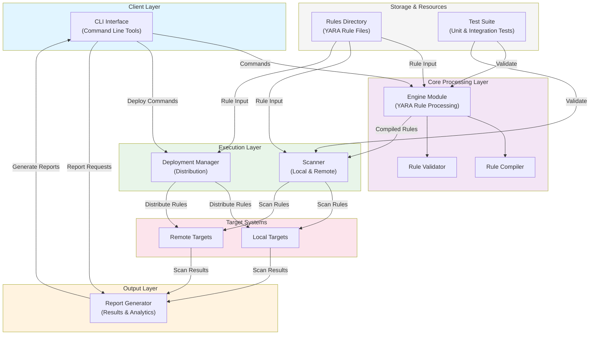

# YaraForge Architecture Overview

## System Architecture



# yaraforge

**YARA rule deployment and scanning automation.**

[](https://python.org)
[](LICENSE)
[](https://virustotal.github.io/yara/)
[](https://github.com/rawqubit/yaraforge)

`yaraforge` is a production-grade CLI tool for managing the full lifecycle of YARA rules — from loading and validation through multi-threaded scanning to deployment across local and remote targets. It is designed for security engineers who need a reliable, scriptable, CI/CD-friendly YARA automation layer.

---

## Features

- **Rule Management** — Load `.yar`/`.yara` files from local directories, remote URLs, or GitHub repositories with automatic syntax validation.
- **Fast Multi-threaded Scanning** — Scan files, directories (recursive), and process memory with a configurable thread pool.
- **Compiled Rule Bundles** — Compile rules to `.yarc` bundles for near-instant reloading in production pipelines.
- **Flexible Deployment** — Deploy rule sets to local paths or remote SSH hosts via `rsync`; sync from public/private GitHub repos.
- **Versioned Deployment History** — Every deployment is logged with SHA-256 bundle hashes, enabling one-command rollback.
- **Multiple Report Formats** — Output scan results as JSON, SARIF 2.1.0 (GitHub Code Scanning), HTML, CSV, or plain text.
- **CI/CD Ready** — Exits with code `1` on matches; SARIF output integrates directly with GitHub Advanced Security.
- **Bundled Rule Library** — Ships with detection rules for malware, ransomware, web shells, and network threats.

---

## Installation

```bash
# From PyPI (recommended)
pip install yaraforge

# From source
git clone https://github.com/rawqubit/yaraforge
cd yaraforge
pip install -e ".[dev]"
```

**System dependency:** YARA must be installed on the system.

```bash
# Ubuntu/Debian
sudo apt install yara

# macOS
brew install yara
```

---

## Quick Start

### Validate rules

```bash
yaraforge validate ./rules/
# ✓ generic_malware.yar (4 rules)
# ✓ ransomware_generic.yar (4 rules)
# ✓ webshell_generic.yar (4 rules)
# 3/3 files valid.
```

### Scan a directory

```bash
yaraforge scan /var/www/html --rules ./rules/ --format text
```

### Scan and output SARIF for GitHub Code Scanning

```bash
yaraforge scan ./src --rules ./rules/ --format sarif --output results.sarif
```

### Compile rules to a bundle

```bash
yaraforge compile ./rules/ --output compiled.yarc
# [✓] Compiled 12 rules → compiled.yarc (14.2 KB, 3.1ms)
```

### Sync rules from GitHub

```bash
yaraforge sync Yara-Rules/rules --dest ./rules/ --branch main
# [✓] Synced 847 rule files to ./rules/
```

### Deploy rules to a remote host

```bash
yaraforge deploy ./rules/ \
  --target-type ssh \
  --target-path /opt/yara/rules \
  --host scanner.internal \
  --user deploy \
  --key-file ~/.ssh/id_ed25519
```

### Scan a running process

```bash
sudo yaraforge scan --rules ./rules/ --pid 1234
```

---

## CLI Reference

```
Usage: yaraforge [OPTIONS] COMMAND [ARGS]...

Options:
  --verbose, -v   Enable debug logging.
  --version       Show version and exit.

Commands:
  scan      Scan files, directories, or processes for YARA matches.
  validate  Validate YARA rule syntax without scanning.
  compile   Compile rules into a fast .yarc bundle.
  sync      Pull rules from a GitHub repository.
  deploy    Deploy rules to a local path or remote SSH host.
  report    Convert an existing JSON scan report to another format.
```

### `scan` options

| Flag | Default | Description |
|------|---------|-------------|
| `--rules, -r` | required | Rule file or directory (repeatable) |
| `--recursive` | `true` | Recursively scan directories |
| `--threads, -t` | `4` | Scanner thread count |
| `--max-size` | `50` MB | Max file size to scan |
| `--timeout` | `60` s | Per-file scan timeout |
| `--format, -f` | `text` | Output format: `json`, `sarif`, `html`, `csv`, `text` |
| `--output, -o` | stdout | Write report to file |
| `--pid` | — | Scan a running process by PID |
| `--exit-code` | `true` | Exit 1 if matches found |

---

## Report Formats

| Format | Use Case |
|--------|----------|
| `text` | Human-readable terminal summary |
| `json` | Machine-readable full detail, pipeline integration |
| `sarif` | GitHub Code Scanning, VS Code SARIF Viewer |
| `html` | Self-contained report for sharing |
| `csv` | Spreadsheet analysis |

### GitHub Code Scanning Integration

Add to `.github/workflows/yara-scan.yml`:

```yaml
name: YARA Scan
on: [push, pull_request]

jobs:
  scan:
    runs-on: ubuntu-latest
    steps:
      - uses: actions/checkout@v4
      - run: pip install yaraforge
      - run: |
          yaraforge scan . \
            --rules rules/ \
            --format sarif \
            --output yara-results.sarif \
            --no-exit-code
      - uses: github/codeql-action/upload-sarif@v3
        with:
          sarif_file: yara-results.sarif
```

---

## Bundled Rules

`yaraforge` ships with a curated rule library under `rules/`:

| Category | Rules | Description |
|----------|-------|-------------|
| `malware/` | 4 | Generic malware patterns, shellcode stubs, C2 beacons |
| `ransomware/` | 4 | Ransom notes, file encryption APIs, WannaCry IoCs |
| `webshells/` | 4 | PHP, ASPX, JavaScript web shell detection |
| `network/` | — | Network-level threat indicators |

---

## Architecture

```
yaraforge/
├── engine/
│   ├── loader.py      # Rule loading, validation, compilation
│   └── scanner.py     # Multi-threaded file/process/memory scanning
├── deploy/
│   └── deployer.py    # Rule deployment, versioning, rollback
├── report/
│   └── reporter.py    # JSON, SARIF, HTML, CSV, text output
└── cli/
    └── main.py        # Click CLI entrypoint
```


---

## Development

```bash
# Install dev dependencies
pip install -e ".[dev]"

# Run tests
pytest tests/ -v --cov=yaraforge

# Lint
ruff check yaraforge/

# Type check
mypy yaraforge/
```

---

## License

MIT — see [LICENSE](LICENSE).
